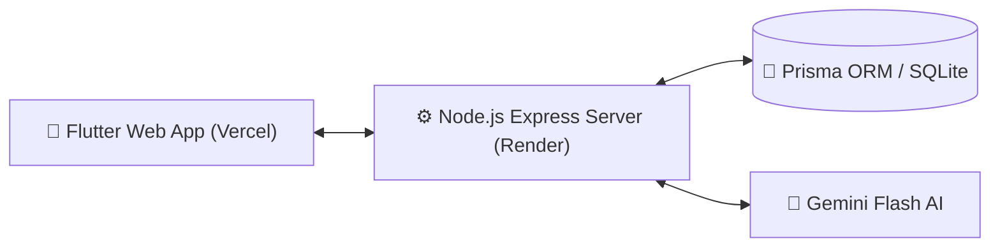
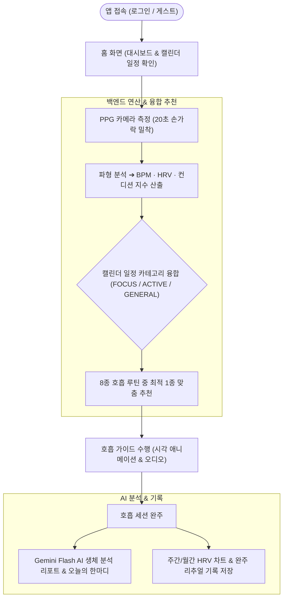

# BPACE

스마트폰 카메라 PPG 센서 기반 심박수·컨디션 측정 및 맞춤형 호흡 케어 웰니스 플랫폼

---

## 배포 링크 (Deployment)

| 서비스 | URL |
| :--- | :--- |
| 웹 (Vercel) | https://bpace.vercel.app |
| 백엔드 API (Render) | https://bpace.onrender.com |
| GitHub 저장소 | https://github.com/yelimk/bpace |

---

## 프로젝트 소개

BPACE는 별도의 웨어러블 기기 없이 **스마트폰 카메라(PPG, 광혈류 측정)** 만으로 사용자의 심박수(BPM) 및 심박변이도(HRV)를 정밀 측정하고, 측정된 생체 데이터와 캘린더 일정 상황을 결합하여 최적의 맞춤형 호흡 루틴과 Gemini Flash AI 분석 리포트를 제공하는 웰니스 케어 솔루션입니다.

---

## 주요 기능 (Key Features)

### 1. 스마트폰 카메라 PPG 생체 측정
- 손가락을 카메라 렌즈 및 플래시에 밀착하여 20초간 초당 30프레임(총 600샘플) 신호 수집
- 심박수(BPM), 심박변이도(HRV SDNN / RMSSD), 컨디션 지수(0~100) 자동 산출
- 신호 품질(`good` / `poor`) 자동 판별

### 2. 의학 근거 기반 5대 카테고리 8종 호흡 루틴

| 카테고리 | 루틴명 | 특징 |
| :---: | :--- | :--- |
| 진정 | 생리학적 한숨 | 이중 들숨 + 긴 날숨으로 폐포를 즉시 확장, 급성 스트레스 및 불안 반응을 빠르게 해소 |
| 이완 | 4-7-8 호흡 | 부교감신경을 집중 활성화하는 수면 유도 및 깊은 이완 전용 기법 |
| 이완 | 4-6 릴렉스 호흡 | 날숨을 들숨보다 길게 유지하여 심박수를 낮추고 긴장을 부드럽게 완화 |
| 집중 | 4-4-4-4 박스 호흡 | 미 해군 NAVY SEALs가 실전 극한 상황에서 사용하는 집중력·평정심 강화 기법 |
| 집중 | 4-2-4-2 세미 박스 호흡 | 박스 호흡의 경량화 버전으로 짧은 시간 안에 집중 상태 진입 |
| 회복 | 5-5 공진 호흡 | 0.1Hz 자율신경 공진 주파수로 HRV를 최대화하고 심신 회복력을 향상 |
| 회복 | 2-1-4-1 횡격막 복식호흡 | 횡격막을 깊이 활성화하여 산소 효율을 높이고 만성 피로를 완화 |
| 각성 | 4-1-2-1 각성 호흡 | 교감신경을 자극하여 집중력과 각성 수준을 빠르게 높이는 활성화 기법 |

### 3. Gemini Flash AI 실시간 분석 & 피드백
- **측정 결과 화면 (measurement_result_screen)**: 생체 수치(BPM·HRV·컨디션 지수) 변동폭 기반 4단계 맞춤형 심박 분석 리포트 실시간 생성
- **호흡 완료 화면 (breathing_completion_screen)**: 호흡 완주 후 루틴별 피드백 + 오늘의 마인드풀니스 감성 문구 (`todaysQuote`) 실시간 생성

### 4. 상황 인지(Context-Aware) 캘린더 융합 케어
- 앱 내 일정 등록 기능 및 30분 전 로컬 알림 발송
- 일정 중요도 및 생체 컨디션 지수를 결합한 의사결정 트리 기반 최적 호흡 추천

### 5. 호흡 수행 화면 몰입 오디오
- 호흡 가이드 수행 화면(`breathing_exercise_screen`)에서 루틴 진행 중 배경 음악 재생
- 배경 오디오는 AI 음악 생성 서비스 **SUNO**로 제작한 오리지널 트랙 사용

### 6. 리추얼 히스토리 & 시각화
- 호흡 완주 기록 로컬 저장 및 서버 동기화
- 월별 아코디언 기록 뷰, 요일별 평균 HRV 차트 시각화

---

## 기술 스택 (Tech Stack)

### Frontend

| 항목 | 내용 |
| :--- | :--- |
| 프레임워크 | Flutter (Dart `>=3.0.0 <4.0.0`) |
| 지원 플랫폼 | Web, Android, iOS, Windows |
| 폰트 | Pretendard, GmarketSans |
| 주요 패키지 | `camera 0.10.5+9`, `http ^1.2.0`, `audioplayers ^6.0.0`, `shared_preferences ^2.5.5`, `permission_handler 11.3.1`, `flutter_local_notifications ^17.2.0`, `firebase_messaging ^15.1.5` |
| 배포 | Vercel (SPA 라우팅 설정 포함) |

### Backend

| 항목 | 내용 |
| :--- | :--- |
| 런타임 | Node.js v20+ |
| 프레임워크 | Express.js v4 |
| ORM | Prisma v6 |
| DB (개발/운영) | SQLite (`file:./dev.db`) |
| 인증 | JWT (`jsonwebtoken`) + bcrypt (`bcryptjs`) |
| AI 연동 | Google AI Studio Gemini Flash — 3.8 / 3.6 / 3.5 순차 폴백 (Free Tier) |
| 배포 | Render Web Service Singapore 리전 (`render.yaml` 포함) |

### 인프라 방침
**100% $0 무료 인프라 준수**: Vercel 무료 티어(Frontend), Render 무료 티어(Backend), Gemini API 무료 티어(AI) — 전액 $0 구성

---

## PPG 측정 알고리즘 및 학술 근거

### 측정 원리
손가락을 스마트폰 카메라와 LED 플래시에 밀착하면, 심장 박동에 따른 피하 미세혈관의 혈류량 변화로 헤모글로빈의 적색 광 흡수율이 미세하게 변동합니다. 초당 30프레임으로 연속 수집한 20초 파형 데이터(600샘플)로 BPM·SDNN·RMSSD·컨디션 지수를 산출합니다. 컨디션 지수는 BPM 정규화 점수(40%)와 HRV 정규화 점수(60%)를 가중 합산하여 **0~100** 범위로 환산합니다. (심박수 상승 및 HRV 저하 상황에 따라 이론상 최저 14점까지 산출됩니다.)

### 컨디션 지수별 호흡 추천 로직

측정된 BPM, RMSSD, 캘린더 일정 카테고리를 조합한 우선순위 기반 의사결정 트리로 1개의 루틴을 추천합니다.

| 우선순위 | 조건 | 추천 루틴 |
| :---: | :--- | :--- |
| 1 | BPM >= 95 (급성 심박 상승) | 생리학적 한숨 |
| 2 | BPM 60~95 + 일정 FOCUS | 4-4-4-4 박스 호흡 |
| 3 | BPM < 60 + 일정 FOCUS / ACTIVE | 4-1-2-1 각성 호흡 |
| 4 | BPM 60~95 + 일정 ACTIVE | 4-1-2-1 각성 호흡 |
| 5 | RMSSD < 25 + 일반/일정 없음 | 4-7-8 호흡 |
| 6 | BPM < 60 + 일반/일정 없음 | 2-1-4-1 횡격막 복식호흡 |
| 7 (기본) | 정상 심박 + 일반/일정 없음 | 5-5 공진 호흡 |

### 스마트폰 카메라 PPG 측정 가능성 및 학술 근거

스마트폰 카메라를 통한 PPG 방식은 다수의 동료 심사(Peer-reviewed) 연구에서 임상적 유효성이 검증되었습니다.

- **IEEE Transactions on Biomedical Engineering (2014)** — 스마트폰 카메라 PPG 기반 심박수가 12유도 심전도(ECG) 대비 r = 0.98의 상관계수를 보이며, HRV 측정 역시 r = 0.95 이상으로 임상적으로 유효함을 입증
- **Nature Scientific Reports (2018)** — 손가락 밀착 카메라 방식으로 측정한 자율신경계 스트레스 지표(RMSSD, SDNN)가 의료기기 수준 측정값과 유의미한 상관관계를 가짐을 확인
- **JMIR mHealth and uHealth (2020)** — 디지털 밴드패스 필터 적용 시 스마트폰 카메라 기반 R-R 간격 측정 오차가 10ms 이내로 유지되어, 일상 맥락(non-clinical setting)에서의 HRV 모니터링 실용성 검증
- **Sensors (MDPI, 2021)** — LED 플래시와 후면 카메라를 활용한 접촉식 PPG(Contact PPG)가 30fps 이상에서 안정적인 심박 파형 복원이 가능하며, 웨어러블 기기 대비 95% 이상의 BPM 일치율 확인

---

## 인증 & 세션 정책

- **이름/닉네임**: 2자 이상 20자 이하
- **비밀번호**: 영문 + 숫자 포함, 8자 이상 64자 이하
- **게스트 세션**: 비회원 접속 시 디바이스 기반 토큰으로 독립 세션 유지
- **미연동 버튼**: 구글 로그인 등 미구현 기능 탭 시 무반응 처리 (`onTap: () {}`)

---

## 서비스 아키텍처 및 흐름도 (Architecture & User Flow)

### 1. 시스템 아키텍처 (System Architecture)

### 2. 사용자 흐름도 (User Flow)

---

## 깃허브 운영 규칙 (GitHub Rules)

커밋 컨벤션 및 브랜치 전략은 [GITHUB_RULES.md](./GITHUB_RULES.md) 문서를 참고하세요.

---

## 라이선스 (License)

MIT License — Copyright (c) 2026 yelimk (BPACE Project)
