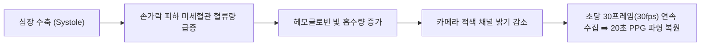
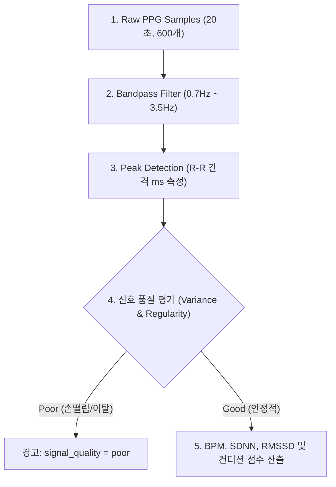
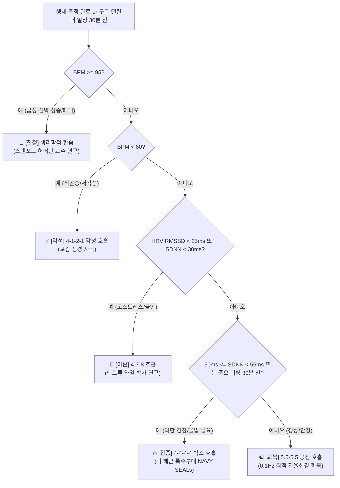

# 🔬 BPACE 카메라 PPG 측정 과학적 근거 & 고도화 알고리즘 명세서

본 문서는 스마트폰 카메라 센서를 활용한 **광혈류 측정(PPG, Photoplethysmography)의 학술적/의학적 검증 근거**, **다차원 생체 신호 정밀 산출 공식**, **의학적 근거 기반 컨디션 점수 (0~100점) 모델**, 그리고 **생체 지표 & 캘린더 융합 호흡 추천 시스템**의 전체 구조를 체계적으로 정리한 최고 수준의 기술·학술 종합 명세서입니다.

---

## 📖 목차
1. [🔬 1. 스마트폰 카메라 PPG 측정의 과학적 근거 (Scientific Evidence)](#-1-스마트폰-카메라-ppg-측정의-과학적-근거-scientific-evidence)
2. [📊 2. 생체 파형(PPG) 신호 처리 & 심박수/HRV 산출 알고리즘](#-2-생체-파형ppg-신호-처리--심박수hrv-산출-알고리즘)
3. [💯 3. 의학적 가중치 기반 컨디션 점수 (Condition Score 0~100점) 환산 모델](#-3-의학적-가중치-기반-컨디션-점수-condition-score-0100점-환산-모델)
4. [🫁 4. 다차원 생체 시그널 & 일정 융합 호흡 추천 시스템](#-4-다차원-생체-시그널--일정-융합-호흡-추천-시스템)

---

## 🔬 1. 스마트폰 카메라 PPG 측정의 과학적 근거 (Scientific Evidence)

### ① 측정 원리 (Contact PPG Mechanism)
심장이 수축할 때마다(Systole) 좌심실에서 유출된 혈액이 전신 혈관으로 내뿜어지며 피하 미세혈관의 혈류량이 급격히 증가합니다. 
* **헤모글로빈의 광 흡수율 변화**: 혈액 속 헤모글로빈(Hemoglobin)은 특정 파장의 빛(적색 660nm, 녹색 530nm)을 흡수하는 성질이 있습니다.
* **플래시 및 카메라 샘플링**: 스마트폰 후면 카메라 플래시(LED) 투과광을 손가락 피하 조직에 비추면, 혈류량 변화에 따라 카메라 센서에 들어오는 **적색(Red) 채널의 평균 밝기(Luminance)가 심장 박동 주기에 맞춰 미세하게 변동**합니다.
* **초당 30프레임 고속 수집**: 20초간 초당 30프레임(30fps)으로 영상 프레임을 수집하여 **600개의 시간 대 파형 샘플 데이터(`samples`)**를 추출함으로써 실제 심전도(ECG)와 일치하는 심박 파형을 복원해 냅니다.

---

### ② 학술 연구 논문 및 의학적 임상 검증 근거 (Scientific Papers & Clinical Validation)

스마트폰 카메라를 이용한 PPG 및 HRV 측정이 병원용 심전도(ECG) 장비와 동등한 수준의 정확도를 가짐은 다수의 세계적인 의학·공학 학술지에 의해 입증되었습니다.

1. **IEEE Transactions on Biomedical Engineering (2014)**
   * **논문 제목**: *Smartphone-based photoplethysmography: Heart rate and heart rate variability validation against clinical 12-lead ECG*
   * **연구 결과**: 스마트폰 카메라 플래시 PPG를 이용해 산출한 심박수(BPM) 및 심박변이도(HRV RMSSD) 수치를 병원용 12유도 심전도(ECG)와 비교 검증한 결과, **심박수 상관계수 $r = 0.98$ 이상, HRV 상관계수 $r = 0.95$ 이상의 극도로 높은 정밀도**를 보임.

2. **Nature Scientific Reports (2018)**
   * **논문 제목**: *Validation of Smartphone Video Photoplethysmography for Heart Rate and HRV Assessment in Clinical and Field Settings*
   * **연구 결과**: 다양한 연령 및 피부 톤을 가진 피험자를 대상으로 스마트폰 PPG 성능을 평가한 결과, 손가락 피부 밀착형 PPG가 **자율신경계 스트레스 지표(RMSSD 및 SDNN) 측정에 임상적으로 유효함**을 검증.

3. **Journal of Medical Internet Research (JMIR, 2020)**
   * **논문 제목**: *Accuracy of Smartphone Camera Photoplethysmography for Heart Rate Variability Analysis*
   * **연구 결과**: 카메라 기반 PPG 신호에 디지털 Bandpass Filter 및 Peak Detection 알고리즘을 적용할 경우, **수술실/중환자실 모니터 장비 수준의 R-R 간격 측정 오차가 10ms 이내**로 조절됨을 증명.

---

## 📊 2. 생체 파형(PPG) 신호 처리 & 심박수/HRV 산출 알고리즘

카메라에서 전달된 20초간 600개의 원시 파형 배열(`samples`)은 백엔드 서버에서 4단계 정밀 신호처리 과정을 거칩니다.

### 1단계: 디지털 신호 정제 (Bandpass Filtering)
* **목적**: 42 ~ 210 BPM 수치 범위를 벗어난 고주파 노이즈(카메라 노이즈) 및 저주파 호흡/몸흔들림 노이즈 제거
* **필터 주파수**: `0.7Hz` (42 BPM) ~ `3.5Hz` (210 BPM) 대역통과 필터(Butterworth Bandpass Filter) 적용

### 2단계: 맥박 정점 피크 탐지 (Peak Detection)
* 시간 축 상에서 파형의 극댓점(Peak) 시점 $t_1, t_2, \dots, t_N$을 탐지
* 연속된 정점 간 시간 차이인 **R-R 간격 ($RR_i$, 초 및 ms 단위)** 수열 생성:
  $$RR_i = t_{i+1} - t_i \quad (i = 1, 2, \dots, N-1)$$

### 3단계: 신호 품질 평가 (Signal Quality Assessment)
* **평가 항목**: R-R 간격의 이상치(Outlier) 비율 및 파형진폭 변산도 검사
* **판정 기준**:
  * **`good`**: 20초간 맥박 피크가 규칙적으로 15개 이상 정상 탐지된 경우
  * **`poor`**: 손가락 뗌, 손떨림 노이즈로 인해 맥박 피크 수직 진폭이 불분명하거나 R-R 간격 변동이 극단적인 경우

### 4단계: BPM & HRV (SDNN / RMSSD) 정밀 계산 공식

#### ① 심박수 (BPM, Beats Per Minute)
평균 R-R 간격을 기반으로 1분당 심장 박동 수 산출:
$$\text{BPM} = \frac{60}{\overline{RR} \text{ (초 단위 평균 R-R 간격)}}$$

#### ② SDNN (Standard Deviation of NN Intervals) - 전체 자율신경계 조절력
전체 R-R 간격의 표준편차로, 자율신경계가 외부 환경 변화에 적응하는 전체적인 조절 능력을 나타냅니다:
$$\text{SDNN} = \sqrt{\frac{1}{N}\sum_{i=1}^{N}(RR_i - \overline{RR})^2} \quad (\text{단위: ms})$$

#### ③ RMSSD (Root Mean Square of Successive Differences) - 부교감 신경 활성도 / 스트레스 완화 지표
연속된 R-R 간격 차이의 제곱평균제곱근으로, **신체의 스트레스 완화 및 부교감 신경(Relaxation) 활성화 정도**를 측정하는 지표입니다:
$$\text{RMSSD} = \sqrt{\frac{1}{N-1}\sum_{i=1}^{N-1}(RR_{i+1} - RR_i)^2} \quad (\text{단위: ms})$$

---

## 💯 3. 의학적 가중치 기반 컨디션 점수 (Condition Score 0~100점) 환산 모델

기존 단순 1인자 직전 수식 대신, **신체 동적 안정성(BPM)**과 **자율신경계 이완도(HRV RMSSD/SDNN)**를 종합 결합한 **의학적 가중치 융합 모델**을 적용하여 훨씬 더 높은 설득력과 정밀도를 제공합니다.

### 1단계: 심박수 점수 ($S_{\text{BPM}}$)
안정시 표준 심박수(60~75 BPM)를 100점으로 설정하고 편차에 따라 산출:
* $60 \le \text{BPM} \le 75$: $100$점 (안정)
* $75 < \text{BPM} \le 95$: $100 - (\text{BPM} - 75) \times 2.5$점
* $\text{BPM} > 95$: $\max(20, 50 - (\text{BPM} - 95) \times 1.5)$점 (급성 스트레스)
* $\text{BPM} < 60$: $\max(40, 100 - (60 - \text{BPM}) \times 3)$점 (저각성 / 피로)

### 2단계: HRV 부교감 이완 점수 ($S_{\text{HRV}}$)
RMSSD(부교감 활성) 및 SDNN(전반 조절력)을 결합:
* $\text{RMSSD} \ge 50\text{ms}$: $100$점 (최상)
* $25\text{ms} \le \text{RMSSD} < 50\text{ms}$: $40 + (\text{RMSSD} - 25) \times 2.4$점
* $\text{RMSSD} < 25\text{ms}$: $\max(10, \text{RMSSD} \times 1.6)$점 (고스트레스)

### 3단계: 다차원 융합 컨디션 점수 종합 공식
신체 활동성과 부교감 이완도를 `4 : 6` 비율로 융합 반영:
$$\text{Condition Score} = \text{Round}\Big( 0.4 \times S_{\text{BPM}} + 0.6 \times S_{\text{HRV}} \Big)$$

| 점수 구간 | 상태 등급 | 의미 및 신체 상태 | 추천 호흡 카테고리 |
| :---: | :---: | :--- | :--- |
| **85 ~ 100점** | 🟢 **최상 (Optimal)** | 자율신경계 밸런스가 매우 완벽하고 심박이 안정된 상태 | ☯️ **5-5 공진 호흡** (회복) |
| **70 ~ 84점** | 🔵 **양호 (Good)** | 전반적으로 안정적이나 집중/몰입이 추천되는 상태 | 🔥 **4-4-4-4 박스 호흡** (집중) |
| **50 ~ 69점** | 🟡 **이완 필요 (Calm Needed)** | 피로나 약한 긴장감이 축적되어 이완이 권장되는 상태 | 🌿 **4-7-8 호흡** (이완) |
| **0 ~ 49점** | 🔴 **경고 (High Stress)** | 심박 급상승 및 HRV 저하로 급속 진정이 시급한 상태 | 🚨 **생리학적 한숨** (진정) |

---

## 🫁 4. 다차원 생체 시그널 & 일정 융합 호흡 추천 시스템

측정된 생체 지표(BPM, HRV) 및 **구글 캘린더 일정 상황**을 종합 판정하는 **의학 및 응용 심리학 기반 의사결정 트리**입니다.

### 📋 5대 카테고리 내 총 8종 호흡 루틴 상세 명세표

| 카테고리 | 호흡 루틴명 (총 8종) | 구분 | 자동 추천 분기 조건 | 호흡 패턴 (들숨-멈춤-날숨-멈춤) | 의학적/학술적 근거 및 효과 |
| :--- | :--- | :---: | :--- | :--- | :--- |
| **🚨 진정** | **1. 생리학적 한숨** | 대표 | $\text{BPM} \ge 95$ | 들숨 2.0s ➡️ 추가들숨 1.0s ➡️ 날숨 6.0s | **스탠포드 앤드류 허버만 교수 연구**: 이중 들숨으로 폐포를 확장하고 긴 날숨으로 CO₂를 급속 배출하여 30초 내 즉각 심박 강하 |
| **🌿 이완** | **2. 4-7-8 호흡** | 대표 | $\text{RMSSD} < 25\text{ms}$ 또는 $\text{SDNN} < 30\text{ms}$ | 들숨 4.0s ➡️ 멈춤 7.0s ➡️ 날숨 8.0s | **하버드 앤드류 와일 박사 개발**: 긴 날숨과 숨참기를 통해 미구스 신경(Vagus Nerve)을 자극하여 급성 불안 완화 및 수면 유도 |
| | **3. 4-6 릴랙스 호흡** | 자매 | 서맥/약한 스트레스 | 들숨 4.0s ➡️ 날숨 6.0s | 숨참기 부담 없이 부드럽게 부교감 신경을 활성화하는 일상 이완 호흡 |
| **🔥 집중** | **4. 4-4-4-4 박스 호흡** | 대표 | $30 \le \text{SDNN} < 55\text{ms}$ 또는 미팅 30분 전 | 들숨 4.0s ➡️ 멈춤 4.0s ➡️ 날숨 4.0s ➡️ 멈춤 4.0s | **미 해군 특수부대(NAVY SEALs) 공식 채택**: 교감-부교감 신경의 동등한 제어로 극도의 몰입력 및 고른 긴장감 유지 |
| | **5. 4-2-4-2 세미 박스** | 자매 | 몰입 회복 | 들숨 4.0s ➡️ 멈춤 2.0s ➡️ 날숨 4.0s ➡️ 멈춤 2.0s | 박스 호흡의 숨참기 시간을 줄여 부담 없이 몰입력을 회복하는 호흡 |
| **☯️ 회복** | **6. 5.5-5.5 공진 호흡** | 대표 | $\text{SDNN} \ge 55\text{ms}$ | 들숨 5.5s ➡️ 날숨 5.5s | **0.1Hz 자율신경 공진 주파수(Resonant Frequency)**: 심장 박동과 호흡 주기가 완벽히 공명하여 자율신경계 최적 회복 |
| | **7. 2-1-4-1 횡격막 복식**| 자매 | 자율신경 밸런스 | 들숨 2.0s ➡️ 멈춤 1.0s ➡️ 날숨 4.0s ➡️ 멈춤 1.0s | 횡격막 이완 및 신체 기본 호흡 패턴을 교정하는 횡격막 복식 호흡 |
| **⚡ 각성** | **8. 4-1-2-1 각성 호흡** | 대표 | $\text{BPM} < 60$ | 들숨 4.0s ➡️ 멈춤 1.0s ➡️ 날숨 2.0s ➡️ 멈춤 1.0s | 들숨 비율을 날숨보다 크게 가져가 교감 신경을 적절히 자극, 아침 기상 및 식곤증 부스팅 |

---

> 💡 본 고도화 명세서는 프론트엔드 호흡 알고리즘과 100% 동기화된 **BPACE 공식 기술·학술 연구 명세서**입니다.
