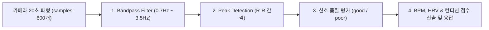
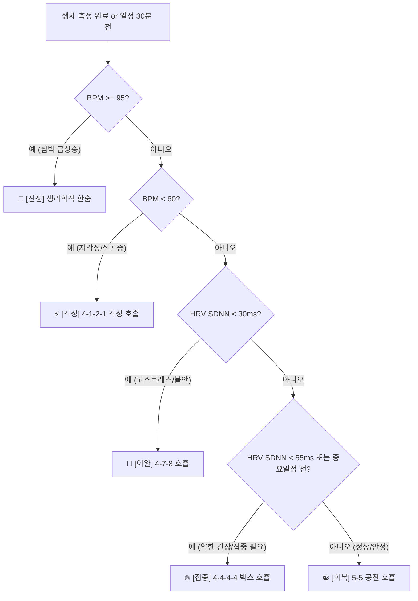

# 🚀 BPACE 백엔드 & 서비스 종합 통합 명세서 (Backend README)

본 문서는 BPACE 백엔드 구축 및 대회 제출/배포 마스터 가이드와 세부 기술 명세서(회원 등급 체계, PPG 계산 수식, 호흡 추천 시스템, Gemini AI 분석 구조)를 **단 하나의 문서로 통합**한 종합 명세서입니다.

> 💡 **핵심 가이드라인 & 운영 방침**:
> 1. 💰 **100% 무료 인프라 준수 (Zero-Cost Infrastructure)**: 본 명세서에 수록된 모든 기술 스택, DB(Supabase/PostgreSQL/SQLite), AI API(Gemini 2.0 Flash Free Tier), 클라우드 호스팅(Render/Railway/Vercel) 및 로컬 알림은 **100% 비용 부담 없는 무료 티어(Free Tier)로 구축**합니다.
> 2. 🎯 **최우선 해커톤 제출 완벽 시연 & 상용 배포 비전 (Hackathon First & Production Vision)**: **최우선 목표는 해커톤 대회 심사위원 대상 완벽한 시연 및 검증(100% 무료 인프라, Suno AI 생성 음원 시연)**에 100% 맞추어 구축합니다. 정식 상용 출시(스토어 배포)는 추후 상용 음원 라이선스 획득 및 프리미엄 구독 모델로 바로 연결되는 **'차기 상용화 로드맵 비전'**으로 설정합니다.
> 3. 📜 **허용적 오픈소스 라이선스 준수 (Permissive License Compliance)**: 프로젝트에 사용되는 모든 라이브러리 및 패키지는 상업적/대회 이용 시 저작권 문제가 없는 **MIT / Apache 2.0 / BSD 등 허용적 라이선스만 사용**하며, 프로젝트 루트에 `LICENSE` (MIT License)를 명시합니다.
> 🔬 **카메라 PPG 학술 근거 & 상세 알고리즘 문서**: [backend/PPG_SCIENTIFIC_EVIDENCE_AND_ALGORITHM.md](file:///c:/Users/82103/Desktop/bpace/backend/PPG_SCIENTIFIC_EVIDENCE_AND_ALGORITHM.md) (IEEE/Nature/JMIR 논문 근거, 심박수/HRV 수식, 50~96점 컨디션 점수 환산, 5대 호흡 추천)

---

## 📌 Part 1. 핵심 구축 목표 및 세부 기능

### 1. 💾 서버 DB 및 회원 데이터 보존 (Server DB & User Data)
* 로컬 저장소와 별개로 클라우드 DB(PostgreSQL/MySQL)에 회원별 정보, 측정 결과, 호흡 수행 내역을 영구 보존.
* **이메일 회원가입 (`POST /api/auth/signup`) 및 로그인 (`POST /api/auth/login`)** 지원.
* **구글 소셜 로그인 연동 (`POST /api/auth/google`)**, **게스트 로그인 (`POST /api/auth/guest`)**, **내 프로필 조회 (`GET /api/auth/me`)** API 제공.

### 2. 🔑 구글 OAuth 2.0 및 구글 캘린더(Google Calendar API) 양방향 동기화
* 구글 소셜 로그인 연동 (`POST /api/auth/google`).
* 구글 로그인 회원 대상 구글 캘린더 권한(`calendar.events`) 요청.
* 앱에서 등록한 일정을 사용자의 실제 **구글 캘린더(Google Calendar)와 양방향 자동 동기화** (`POST /api/calendar/sync`).

### 3. 🩸 서버 측 생체 파형 계산 & 🤖 AI 맞춤 분석 (Gemini / OpenAI API)
* **서버 측 심박수 & HRV 정밀 계산 (`POST /api/measurements`)**:
  * 프론트엔드 카메라에서 수집한 20초 파형 샘플 데이터(`samples`)를 서버가 받아 **서버에서 심박수(BPM), HRV(ms), 컨디션 점수를 정밀하게 계산**하여 응답.
* **호흡 완수 피드백 AI 분석 (`POST /api/ai/feedback`)**:
  * 세션 완수율, BPM 변화량을 AI 프롬프트로 전달해 호흡 맞춤 피드백 멘트 생성.
* **로그 페이지 분석 탭 AI 종합 진단 (`POST /api/ai/analyze-trend`)**:
  * 주간 HR/HRV 추이 데이터를 분석해 자율신경계 상태 및 스트레스 완화 팁 멘트 생성.

### 4. 🔔 일정 & 루틴 알림 (Local Notification & Push)
* **스마트폰 로컬 알림 (Flutter Local Notifications - 100% 무료)**:
  * 일정 시작 30분/1시간 전 긴장 완화 호흡 알림 및 매일 아침 루틴 측정 알림은 서버/인터넷 연결 필요 없이 **앱 단독 로컬 알림 기능**으로 정확히 발송.
* **[선택] FCM 원격 푸시 알림**:
  * 백엔드 공지사항이나 외부 이벤트 전송 필요 시 선택적 활용.

### 5. 🏆 대회 제출 전략 & 📱 배포/출시 가이드
* **백엔드 클라우드 배포**: Render / Railway / AWS 환경에 HTTPS 서버 및 `.env` 보안 환경 변수 적용 후 배포.
* **대회 제출용 링크 구성 전략**:
  * **메인 제출**: **`안드로이드 APK 다운로드 링크`** (카메라 및 플래시 실측용 정식 서비스)
  * **보조 제출**: **`Vercel 웹 시연 링크`** (심사위원의 빠른 화면/UI 시연용)
* **앱 배포 vs APK 파일 차이점**:
  * `APK`: 개발자 수동 테스트용 압축 파일.
  * `AAB (.aab)`: 구글 플레이 스토어(Google Play Console)에 제출하는 정식 검수용 표준 배포 파일.
* **플레이 스토어 출시 절차**: `flutter build aab --release` ➡️ Google Play Console 등록 ➡️ 구글 심사 후 정식 출시.

### 6. 추진 단계 로드맵
1. **1단계 (기본 환경 & DB 구축)**: 백엔드 초기화 및 PostgreSQL/MySQL 핵심 테이블 설계
2. **2단계 (서버 측 파형 계산 API)**: 파형 샘플 받아 심박수/HRV 정밀 계산하는 `/api/measurements` 구축
3. **3단계 (Google OAuth & Google Calendar API 연동)**: 구글 캘린더 양방향 일정 동기화 로직 구현
4. **4단계 (Gemini/OpenAI AI 모듈 탑재)**: 호흡 피드백 및 분석 탭 AI 분석 API 구현
5. **5단계 (클라우드 배포 & 대회 제출)**: Render/Supabase 무료 배포 및 APK / Vercel 웹 제출 링크 준비
6. **6단계 (로컬 알림 & FCM)**: 앱 내 로컬 알림(Flutter Local Notifications) 구축 및 필요시 FCM 푸시 연동

---

## 📄 Part 2. 백엔드 & 서비스 세부 기술 명세 (SPECIFICATION)

### 👥 1. 회원 등급 체계 (User Tiers)

| 구분 | 👤 비회원 (Guest) | 🔐 일반 회원 (Member) |
| :--- | :--- | :--- |
| **로그인 / 가입** | 로그인 없이 즉시 시작 (로컬 기기 전용) | 구글 OAuth 2.0 / 이메일 로그인 |
| **데이터 저장** | 스마트폰 내 로컬 DB(SQLite)에 저장 | **클라우드 DB 영구 보존 & 기기 간 동기화** |
| **구글 캘린더** | ❌ 로컬 일정만 가능 | ⭕ **구글 캘린더 양방향 실시간 자동 동기화** |
| **PPG 생체 측정** | ⭕ 전 기능 동일 지원 (BPM, HRV) | ⭕ 전 기능 동일 지원 (BPM, HRV) |
| **호흡 추천** | ⭕ 전 기능 동일 지원 (상태별 맞춤 추천) | ⭕ 전 기능 동일 지원 (상태별 맞춤 추천) |
| **Gemini AI 분석** | ⭕ 전 기능 동일 지원 (세션 피드백 & 주간 분석) | ⭕ 전 기능 동일 지원 (세션 피드백 & 주간 분석) |

> 💡 **사용자 경험(UX) 전략**: 진입 장벽을 낮추기 위해 **PPG 측정, 호흡 추천, Gemini AI 피드백은 비회원/회원 모두에게 동일하게 제공**하며, 회원으로 전환 시 **[클라우드 DB 안전 백업]**과 **[구글 캘린더 연동]** 혜택을 부여합니다.

---

### 🩸 2. 생체 파형(PPG) 계산 알고리즘 (`POST /api/measurements`)

스마트폰 카메라에서 수집한 20초간의 적색 채널 밝기 파형 데이터(`samples`: 600개 배열, ~30fps)를 백엔드 서버가 받아 수치화합니다.



#### 세부 수식 및 단계:
1. **신호 정제 (Filtering)**: 노이즈(손떨림, 조명 미세 흔들림) 제거를 위해 42~210 BPM 범위인 `0.7Hz ~ 3.5Hz 밴드패스 필터` 적용.
2. **피크 탐지 (Peak Detection)**: 수평축 시간(ms) 대비 파형의 맥박 상단 정점(Peak)을 탐지하여 R-R 간격($RR_i$) 측정.
3. **상태 감지 및 품질 평가 (Status & Quality)**:
   * **네트워크 연결 필수 (Network Mandatory)**: 인터넷(Wi-Fi / 5G) 연결이 필수적이며, 연결 끊김 시 "네트워크 연결 필요" 팝업 표시 및 측정 불가.
   * **맥박 파형 신호 품질 (Pulse Signal Quality)**: 손가락 밀착 후 20초 파형 수집 중 손떨림 노이즈 여부 검사 (`good`, `poor`). 손가락 이탈 시 프론트엔드가 즉시 팝업 안내.
4. **BPM 계산**:
   $$\text{BPM} = \frac{60}{\text{평균 R-R 간격 (초)}}$$
5. **HRV(심박변이도) 계산**:
   * **SDNN** (전반적인 자율신경계 조절력): R-R 간격의 표준편차
     $$\text{SDNN} = \sqrt{\frac{1}{N}\sum_{i=1}^{N}(RR_i - \overline{RR})^2}$$
   * **RMSSD** (부교감 신경 활성도 / 스트레스 완화 지표): 연속 R-R 차이의 제곱평균제곱근
     $$\text{RMSSD} = \sqrt{\frac{1}{N-1}\sum_{i=1}^{N-1}(RR_{i+1} - RR_i)^2}$$
6. **컨디션 점수 & 응답 JSON**:
   * 안정 심박수(60~80 BPM) 및 RMSSD 기준으로 `0~100점` 환산 후 아래 응답 반환:
   ```json
   {
     "bpm": 72,
     "hrv": 45.2,
     "sdnn": 52.1,
     "condition_score": 85,
     "signal_quality": "good"
   }
   ```

---

### 🫁 3. 호흡 추천 시스템 (Ritual Recommendation)

프론트엔드에 정의된 **총 8종류의 호흡 루틴**을 5대 카테고리(진정, 이완, 집중, 회복, 각성)로 분류하고, 측정된 **BPM, HRV(SDNN/RMSSD), 일정 상황(캘린더)**에 따라 최적의 호흡법을 자동으로 추천합니다.



#### 앱 보유 총 8종 호흡 루틴 (5대 카테고리):
1. **🚨 진정 카테고리**:
   * **생리학적 한숨** (들숨 2초 + 추가들숨 1초 / 날숨 6초) - 급속 심박 강하 & 이중 들숨
2. **🌿 이완 카테고리**:
   * **4-7-8 호흡** (들숨 4초 / 멈춤 7초 / 날숨 8초) - 급성 긴장 완화 & 수면 유도
   * **4-6 릴랙스 호흡** (들숨 4초 / 날숨 6초) - 일상적인 자율신경계 부드러운 이완
3. **🔥 집중 카테고리**:
   * **4-4-4-4 박스 호흡** (들숨 4초 / 멈춤 4초 / 날숨 4초 / 멈춤 4초) - 미팅/시험 전 마인드 몰입
   * **4-2-4-2 세미 박스 호흡** (들숨 4초 / 멈춤 2초 / 날숨 4초 / 멈춤 2초) - 부담 없는 몰입 회복
4. **☯️ 회복 카테고리**:
   * **5-5 공진 호흡** (들숨 5초 / 날숨 5초) - 심박변이 공진 & 자율신경계 밸런스
   * **2-1-4-1 횡격막 복식호흡** (들숨 2초 / 멈춤 1초 / 날숨 4초 / 멈춤 1초) - 횡격막 이완
5. **⚡ 각성 카테고리**:
   * **4-1-2-1 각성 호흡** (들숨 4초 / 멈춤 1초 / 날숨 2초 / 멈춤 1초) - 아침 기상 & 식곤증 부스팅

#### 🔮 추후 프리미엄 상용화 확장 비전 (Future Monetization Vision)
현재 MVP/대회 버전에서는 모든 유저에게 8종 호흡과 기본 AI 피드백을 무료 개방하지만, 추후 상용화 시 아래 프리미엄 비즈니스 모델로 확장할 수 있습니다:
1. **자매 호흡 루틴 해금 (Premium Ritual Unlock)**:
   * 5대 대표 호흡(생리학적 한숨, 4-7-8, 박스호흡, 5-5 공진, 각성호흡)은 무료 제공.
   * 자매 호흡 루틴(**4-6 릴랙스, 4-2-4-2 세미박스, 2-1-4-1 횡격막 복식호흡**)은 프리미엄 구독 시 해금.
2. **주간 / 월간 자율신경계 AI 심층 리포트 (Weekly/Monthly AI Reports)**:
   * 주간/월간 심박변이도(HRV) 추이 및 스트레스 누적 그래프 기반 심층 AI 분석 PDF/리포트 발행.

---

### 🤖 4. Gemini AI 분석 구조

Gemini 2.0 Flash API를 활용하여 2가지 형태의 맞춤 분석 멘트를 생성합니다.

#### ① 세션 직후 피드백 (`POST /api/ai/feedback`)
* **전달 데이터**: 측정 BPM, HRV(RMSSD), 선택한 호흡 세션 완수율(%), 사용자의 호흡 후 소감/메모
* **AI 역할**: 사용자의 심박 안정화를 따뜻하게 격려하고, 신체 변화에 대한 과학적 기반의 다정한 조언 2~3줄 제공.

#### ② 주간 추이 AI 종합 진단 (`POST /api/ai/analyze-trend`)
* **전달 데이터**: 최근 7일간의 평균 BPM 추이, RMSSD 수치 변화, 주간 호흡 완수 횟수
* **AI 역할**: "이번 주 자율신경계 이완도가 지난주 대비 15% 개선되었습니다"와 같은 주간 총평 및 다음 주 맞춤 관리 팁 리포트 생성.
