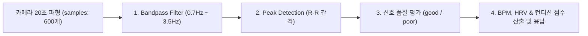
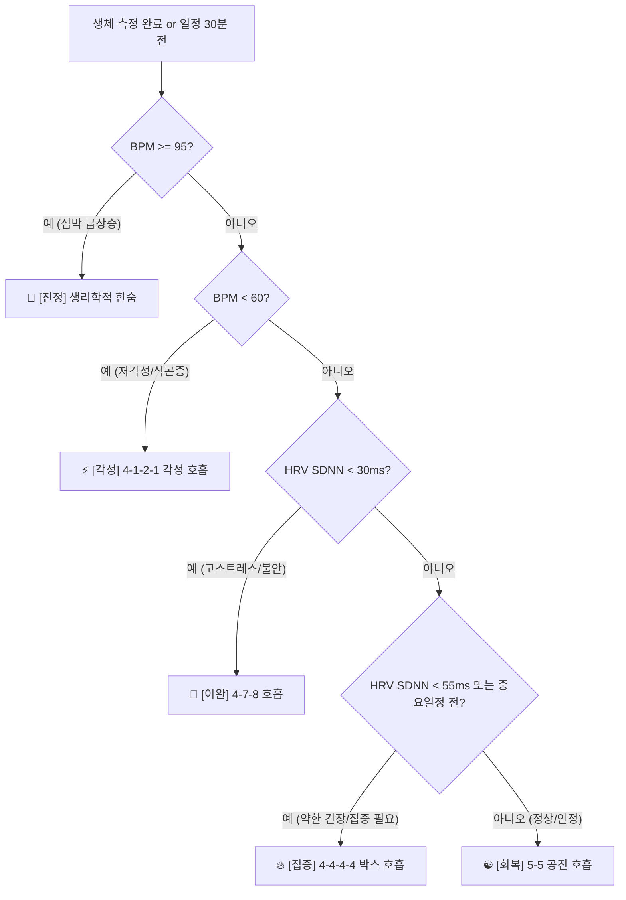

# 📄 BPACE 백엔드 & 서비스 세부 명세서 (SPECIFICATION.md)

본 문서는 BPACE 앱의 **회원 등급 체계, 생체 파형(PPG) 계산 알고리즘, 호흡 추천 시스템, Gemini AI 분석 구조**를 정의한 기술 명세서입니다.

---

## 👥 1. 회원 등급 체계 (User Tiers)

| 구분 | 👤 비회원 (Guest) | 🔐 일반 회원 (Member) |
| :--- | :--- | :--- |
| **로그인 / 가입** | 로그인 없이 즉시 시작 (로컬 기기 전용) | 구글 OAuth 2.0 / 이메일 로그인 |
| **데이터 저장** | 스마트폰 내 로컬 DB(SQLite)에 저장 | **클라우드 DB 영구 보존 & 기기 간 동기화** |
| **구글 캘린더** | ❌ 로컬 일정만 가능 | ⭕ **구글 캘린더 양방향 실시간 자동 동기화** |
| **PPG 생체 측정** | ⭕ 전 기능 동일 지원 (BPM, HRV) | ⭕ 전 기능 동일 지원 (BPM, HRV) |
| **호흡 추천** | ⭕ 전 기능 동일 지원 (상태별 맞춤 추천) | ⭕ 전 기능 동일 지원 (상태별 맞춤 추천) |
| **Gemini AI 분석** | ⭕ 전 기능 동일 지원 (세션 피드백 & 주간 분석) | ⭕ 전 기능 동일 지원 (세션 피드백 & 주간 분석) |

> 💡 **사용자 경험(UX) 전략**: 진입 장벽을 낮추기 위해 **PPG 측정, 호흡 추천, Gemini AI 피드백은 비회원/회원 모두에게 동일하게 제공**하며, 회원으로 전환 시 **[클라우드 DB 안전 백업]**과 **[구글 캘린더 연동]** 혜택을 부여합니다.


---

## 🩸 2. 생체 파형(PPG) 계산 알고리즘 (`POST /api/measurements`)

스마트폰 카메라에서 수집한 20초간의 적색 채널 밝기 파형 데이터(`samples`: 600개 배열, ~30fps)를 백엔드 서버가 받아 수치화합니다.



### 세부 수식 및 단계:
1. **신호 정제 (Filtering)**: 노이즈(손떨림, 조명 미세 흔들림) 제거를 위해 42~210 BPM 범위인 `0.7Hz ~ 3.5Hz 밴드패스 필터` 적용.
2. **피크 탐지 (Peak Detection)**: 수평축 시간(ms) 대비 파형의 맥박 상단 정점(Peak)을 탐지하여 R-R 간격($RR_i$) 측정.
3. **상태 감지 및 품질 평가 (Status & Quality)**:
   * **네트워크 연결 필수 (Network Mandatory)**: 인터넷(Wi-Fi / 5G) 연결이 필수적이며, 연결 끊김 시 "네트워크 연결 필요" 팝업 표시 및 측정 불가.
   * **맥박 파형 신호 품질 (Pulse Signal Quality)**: 손가락 밀착 후 20초 파형 수집 중 손떨림 노이즈 여부 검사 (`good`, `poor`). 손가락 이탈 시 프론트엔드가 즉시 팝업 안내.


4. **BPM 계산**:
   $$\text{BPM} = \frac{60}{\text{평균 R-R 간격 (초)}}$$
5. **HRV(심박변이도) 계산**:
   * **SDNN** (전반적인 자율신경계 조절력): R-R 간격의 표준편차
     $$\text{SDNN} = \sqrt{\frac{1}{N}\sum_{i=1}^{N}(RR_i - \overline{RR})^2}$$
   * **RMSSD** (부교감 신경 활성도 / 스트레스 완화 지표): 연속 R-R 차이의 제곱평균제곱근
     $$\text{RMSSD} = \sqrt{\frac{1}{N-1}\sum_{i=1}^{N-1}(RR_{i+1} - RR_i)^2}$$
6. **컨디션 점수 & 응답 JSON**:
   * 안정 심박수(60~80 BPM) 및 RMSSD 기준으로 `0~100점` 환산 후 아래 응답 반환:
   ```json
   {
     "bpm": 72,
     "hrv": 45.2,
     "sdnn": 52.1,
     "condition_score": 85,
     "signal_quality": "good"
   }
   ```


---

## 🫁 3. 호흡 추천 시스템 (Ritual Recommendation)

프론트엔드에 정의된 **총 8종류의 호흡 루틴**을 5대 카테고리(진정, 이완, 집중, 회복, 각성)로 분류하고, 측정된 **BPM, HRV(SDNN/RMSSD), 일정 상황(캘린더)**에 따라 최적의 호흡법을 자동으로 추천합니다.



### 앱 보유 총 8종 호흡 루틴 (5대 카테고리):
1. **🚨 진정 카테고리**:
   * **생리학적 한숨** (들숨 2초 + 추가들숨 1초 / 날숨 6초) - 급속 심박 강하 & 이중 들숨
2. **🌿 이완 카테고리**:
   * **4-7-8 호흡** (들숨 4초 / 멈춤 7초 / 날숨 8초) - 급성 긴장 완화 & 수면 유도
   * **4-6 릴랙스 호흡** (들숨 4초 / 날숨 6초) - 일상적인 자율신경계 부드러운 이완
3. **🔥 집중 카테고리**:
   * **4-4-4-4 박스 호흡** (들숨 4초 / 멈춤 4초 / 날숨 4초 / 멈춤 4초) - 미팅/시험 전 마인드 몰입
   * **4-2-4-2 세미 박스 호흡** (들숨 4초 / 멈춤 2초 / 날숨 4초 / 멈춤 2초) - 부담 없는 몰입 회복
4. **☯️ 회복 카테고리**:
   * **5-5 공진 호흡** (들숨 5초 / 날숨 5초) - 심박변이 공진 & 자율신경계 밸런스
   * **2-1-4-1 횡격막 복식호흡** (들숨 2초 / 멈춤 1초 / 날숨 4초 / 멈춤 1초) - 횡격막 이완
5. **⚡ 각성 카테고리**:
   * **4-1-2-1 각성 호흡** (들숨 4초 / 멈춤 1초 / 날숨 2초 / 멈춤 1초) - 아침 기상 & 식곤증 부스팅


### 🔮 추후 프리미엄 상용화 확장 비전 (Future Monetization Vision)
현재 MVP/대회 버전에서는 모든 유저에게 8종 호흡과 기본 AI 피드백을 무료 개방하지만, 추후 상용화 시 아래 프리미엄 비즈니스 모델로 확장할 수 있습니다:
1. **자매 호흡 루틴 해금 (Premium Ritual Unlock)**:
   * 5대 대표 호흡(생리학적 한숨, 4-7-8, 박스호흡, 5-5 공진, 각성호흡)은 무료 제공.
   * 자매 호흡 루틴(**4-6 릴랙스, 4-2-4-2 세미박스, 2-1-4-1 횡격막 복식호흡**)은 프리미엄 구독 시 해금.
2. **주간 / 월간 자율신경계 AI 심층 리포트 (Weekly/Monthly AI Reports)**:
   * 주간/월간 심박변이도(HRV) 추이 및 스트레스 누적 그래프 기반 심층 AI 분석 PDF/리포트 발행.


Gemini 2.0 Flash API를 활용하여 2가지 형태의 맞춤 분석 멘트를 생성합니다.

### ① 세션 직후 피드백 (`POST /api/ai/feedback`)
* **전달 데이터**: 측정 BPM, HRV(RMSSD), 선택한 호흡 세션 완수율(%), 사용자의 호흡 후 소감/메모
* **AI 역할**: 사용자의 심박 안정화를 따뜻하게 격려하고, 신체 변화에 대한 과학적 기반의 다정한 조언 2~3줄 제공.

### ② 주간 추이 AI 종합 진단 (`POST /api/ai/analyze-trend`)
* **전달 데이터**: 최근 7일간의 평균 BPM 추이, RMSSD 수치 변화, 주간 호흡 완수 횟수
* **AI 역할**: "이번 주 자율신경계 이완도가 지난주 대비 15% 개선되었습니다"와 같은 주간 총평 및 다음 주 맞춤 관리 팁 리포트 생성.
